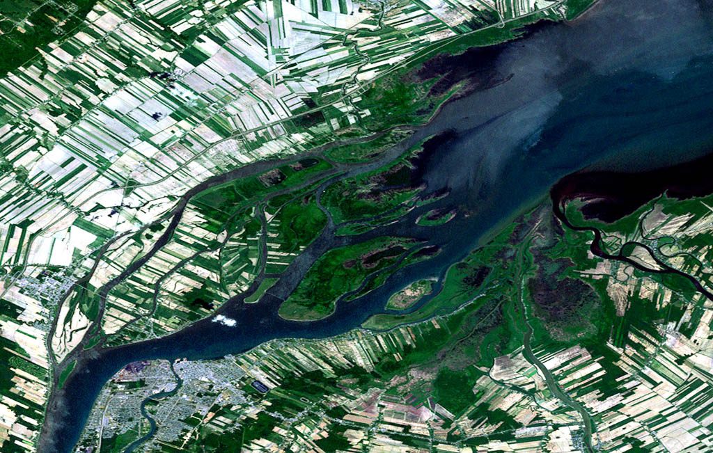
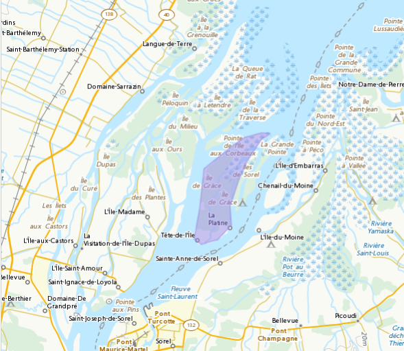
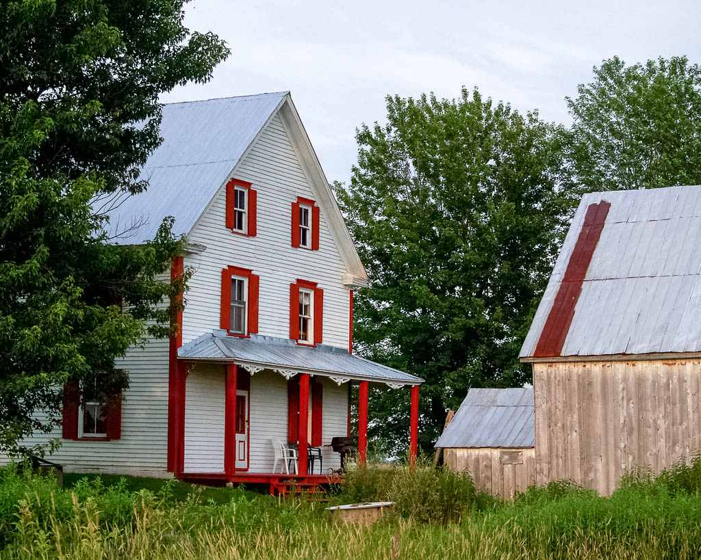
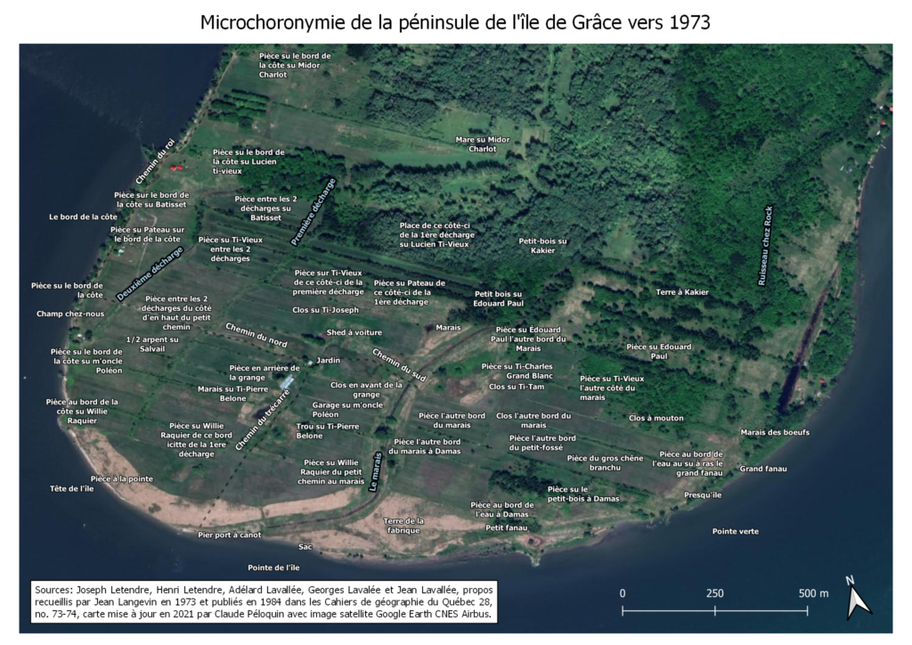

Corrections 5 juin 2021

En comparaison aux îles habitées mentionnées plus haut, l’île de Grâce est plus isolée dans l’espace. C’est sans doute pour cette raison que l'habitation de cette île aurait commencé plus tardivement que les autres, et qu’elle est demeurée jusqu’à la fin, pour ainsi dire, «pionnière» : sans électricité, accès routier, ou eau courante.

Et puis un lent déclin a lieu, s'accélérant dans les années 1930 et 1940. Dans la décennie suivante, il ne reste que deux cultivateurs, 

Mare à Gérard, creusée par Gérard Lavallée. L'article de Langevin mentionne que M. Lavallée s’y noya vers l’âge de 20 ans, mais sa noyade a eu lieu dans le fleuve à l'ouest de l'île, en 1961; mon grand-père y avait repêché son corps. La Presse du 10 octobre 1961 (p. 3) indique que «M. Gérard Lavaléée, âgé de 21 ans, de St-Anne-de-Sorel, s'est noyé dans le fleuve. Il était avec un compagnon dans une chaloupe qui a chaviré.» 

(La Presse, 10 octobre 1961, p.3

# L’île de Grâce

L’île de Grâce a été, pendant plus d’un siècle, au cœur de l’écoumène insulaire, c’est-à-dire de l’espace habité, de l’archipel du lac Saint-Pierre. Je m’intéresse ici à la géographie historique de cette île et de sa relation avec le reste de Sainte-Anne-de-Sorel.  

## Les îles de Sorel

Situé sur le fleuve Saint-Laurent à peu près à mi-chemin entre Montréal et Québec, l’archipel du lac Saint-Pierre est en fait un delta formé par la sédimentation des matériaux transportés jusque là par le courant depuis la dernière déglaciation. À mesure que le débit du cours d’eau ralentit à l’approche de la grande cuvette peu profonde que constitue le lac, sa capacité de transport diminue, laissant tomber vers le fond argiles, limons et sables qui en viennent à former des dépôts. Ces dépôts évolueront au gré des saisons et des divers régimes de crues, gels, dégels qu’elles apportent, formant d’innombrables chenaux, baies, îles, et presqu’îles. L’immense habitat semi-inondé ainsi créé est remarquablement riche en faunes aviaire et aquatique et caractérisé par un fort potentiel agricole depuis longtemps mis en valeur.  

  
*Image satellite Landsat du delta du lac Saint-Pierre en 2003*  

## Le peuplement des îles

Après l’établissement des villes et villages sur la rive sud du fleuve, à Sorel et ses environs, et sur la rive nord, à Berthier, à partir de la deuxième moitié du 17e siècle, l’île Dupas et l’île Saint-Ignace furent les premières à être habitées, dès le début des années 1700. L’habitation de ces îles a duré jusqu’à nos jours, l’électricité et des ponts routiers reliant ces deux îles à Berthier depuis les années 1930 ayant grandement encouragé la permanence de cette occupation.  

Du côté sud de l’archipel, au large de ce que devient en 1876 la paroisse de Sainte-Anne-de-Sorel, c’est l’île du Moine, seulement séparée de la terre ferme par un chenal étroit (environ 100 mètres de largeur), qui aurait été la première à être habitée, également au début des années 1700. De nos jours, ce sont l’île aux Fantômes et l’île d’Embarras qui sont habitées à l’année (et reliées à la terre ferme par des ponts routiers).

## L’île de grâce

En comparaison aux îles habitées mentionnées ci-haut, l’île de Grâce est plus isolée dans l’espace. Elle est aussi plus basse, donc plus souvent inondée. C’est sans doute pour ces raisons que l’habitation de cette île aurait commencé plus tardivement que les autres, et qu’elle est demeurée jusqu’à la fin, pour ainsi dire, «pionnière» : sans électricité, accès routier, ou eau courante.

Cette île plate, d’approximativement deux kilomètres de largeur et cinq kilomètres de longueur, est aussi en quelque sorte une île archétypique de la région. La partie en amont a longtemps fourni de très riches récoltes de foin permettant l’établissement d’une communauté agricole, et des boisés fournissant matériaux de construction et bois de chauffage. La partie en aval, avec ses grandes baies et nombreuses mares a été un remarquable terrain de chasse à l’oie, au canard; la baie de l’île de grâce, un très bon coin de pêche. C’est aussi l’une des îles qui a grandement souffert de l’érosion résultant des diverses transformations hydriques liées à l’établissement de la voie navigable du Saint-Laurent depuis la deuxième moitié du vingtième siècle.

  
*Localisation de l’île de Grâce (en mauve) dans la Base de données toponymiques du Canada*

L’île de Grâce faisait partie de la demi-douzaine d’îles incluse dans les terres concédées en 1672 à Pierre de Saurel par le roi Louis XIV. Après la mort de M. de Saurel en 1682, Mme de Saurel, continuant de diriger la seigneurie, en vient à vendre la propriété de cette île «a partie des habitants dudit lieu» en 1683. Cela dit, rien n’indique que l’île elle-même était habitée à ce moment; la transaction concernait sans doute que les droits de commune et de pacage. 

Près de cent-cinquante ans plus tard, le recensement de 1825 rapporte 16 maisons, une population totale de 70 personnes, dont 34 enfants (moins de 14 ans). On y retrouve les familles Cournoyer, Lavallée, Vandaigle, Cournoyer, Turgeon, Bérard, Hazur, Pelletier, Robert, Rajotte et Bibeau. Quarante ans plus tard, on y trouve une vingtaine de familles, et ce, malgré les [inondations catastrophiques de 1865](https://www.soreltracy.com/2015/avril/7a.html) qui firent 18 victimes, dont 11 enfants, et durant lesquels tous les bâtiments furent détruits et emportés par les flots.

Au tournant du vingtième siècle, on estime que la population atteint un sommet, entre 125 et 150 habitants. L’île contient maintenant des chemins, plusieurs maisons et bâtiments de fermes, des puits, une école. On y élève des animaux, y cultive le foin, et coupe du bois. En hiver, on traverse le fleuve sur le pont de glace qui relie l’île au rivage de Sainte-Anne-de-Sorel (une distance d’environ un kilomètre) pour y vendre ces produits et pour maintenir les liens familiaux. En été, on traverse par bateau.  

Et puis un lent déclin s’amorce. Rodolphe De Koninck (2000) rapporte que l’île ne compte plus que cinquante habitants en 1950, regroupés dans sept familles. Un peu plus tard, il ne reste que deux cultivateurs, Joseph Letendre et son fils Henri Letendre; finalement, ce dernier y demeurera seul pendant de nombreuses années, jusqu’à son décès en 2003. L’île est inhabitée depuis.  

  
*La maison Letendre, en 2008*  

Cet exode fut principalement déclenché par l’activité croissante des brise-glaces depuis les années 1930. Initialement, ces bateaux commençaient à circuler sur le lac Saint-Pierre au mois de février, et puis de plus en plus tôt chaque année, jusqu’en 1953, quand ils commencent à circuler tout l’hiver, signalant la fin du pont de glace, et donc, un isolement de plusieurs mois.  

«*Le pont de glace ne survécut qu’un mois, trois semaines, deux semaines… Plus s’écourtait la durée du pont de glace, plus l’île se vidait de ses habitants. Durant ces années difficiles, le curé de la paroisse, prévenu par les autorités du port de Montréal, annonçait en chaire, deux semaines à l’avance, l’arrivée des brise-glaces. “Ça, ça voulait dire qui fallait qu’on s’grouille pour sortir not'foin, pis not'bois. À la fin, on n’avait pu rien qu’deux semaines en toute pour sortir tout not' barda. C’tait pus vivable”*» (De Konninck, 2000, p. 63).  

## Le territoire nommé

Les façons dont les collectivités nomment les lieux de leur territoire nous en disent long sur leur usage et sur leur perception de l’espace, et, ainsi, sur l’organisation sociale. C’est pour cette raison que la géographie humaine s’intéresse aux désignations d’un lieu donné, d’un cours d’eau, d’un élément de relief, ou même, de l’espace imaginé, par exemple, un imaginaire politique.  

En 1966, les géographes Henri Dorion et Louis-Edmond Hamelin proposent que la notion de toponymie, qu’ils considèrent comme trop étroitement axée sur la désignation des lieux, soit remplacée par la notion de choronymie qui serait, selon eux, plus englobante. Cette choronymie inclut bien sûr les toponymes conventionnels, mais aussi les régionymes (noms des grands espaces), les hydronymes (noms des cours ou des surfaces d’eau), les terranymes (noms des éléments terrestres) et même des aéronymes (noms des espaces aériens) et les glacionymes (îles de glace), tout en étant davantage sensible aux divers aspects qualitatifs qui peuvent altérer ces noms.  

C’est dans ce contexte que le géographe Jean Langevin, également affilié à l’Université Laval, mena en 1973 une étude sur les appellations des espaces de l’île de Grâce par ses habitants. Un compte rendu de cette recherche fut publié dix ans plus tard, en 1984 dans les Cahiers de géographie du Québec, sous le titre «Notes choronymiques sur l’île de Grâce ou le témoignage d’un territoire nommé». Cet article est à mon avis l’un des documents les plus révélateurs sur l’organisation spatiale de cette île. J’en résume ici quelques éléments toujours d’intérêt en 2021.  

La préface de l’article, rédigée par Rodolphe De Koninck, nous apprend que Jean Langevin s’est rendu sur l’île à l’été 1973 pour recueillir des témoignages concernant la microdésignation de ce territoire qui, comme il le remarque, est abondamment nommé bien que l’île soit presque déserte depuis 1953. M. De Koninck concède que «le dossier est certes incomplet et pourrait faire l’objet de nombreuses retouches et additions du genre transcription phonétique, vérification de terrain, classification des hydronymes et des agronymes», mais que «les moyens nécessaires pour parfaire l’enquête ne sont pas facilement disponibles». Malgré ces limitations, M. De Koninck juge important que les «résultats de l’enquête patiente, habile et originale qui avait été réalisée par Jean Langevin fassent l’objet d’une plus grande diffusion» alors, qu’à l’époque, «l’étude “dort” depuis dix ans déjà».  

L’étude de M. Langevin, donc, documente les appellations des lieux de l’île de Grâce utilisées par Joseph et Henri Letendre, alors les deux seuls résidents de l’île, ainsi que par Adélard Lavallée, Georges Lavallée, et Jean Lavallée, d’anciens insulaires qui ont accompagné M. Langevin durant ses visites sur l’île. L’article de 1984 nous présente deux cartes toponymiques (ou choronymiques) issues de cette enquête : l’une illustrant la pointe de l’île principalement cultivée et historiquement habitée, en amont, et l’autre, l’ensemble de baies, sous-baies et mares qui caractérisent la partie aval de l’île. La reproduction de ces cartes laissant à désirer, j’en ai projeté l’information sur une image satellite récente.  

  
*Noms de lieux documentés par Langevin (1984) superposés à une image satellite récente de la pointe de l’île de Grâce* 

Un glossaire et un répertoire d’explications accompagnent ces cartes. J’en résume ici quelques éléments.  
Une «pièce» ici fait référence à la partie d’une terre réservée à la culture pour les animaux en hivernement, comme le foin et l’avoine.  

Les «clos» sont les parties des terres dans lesquelles le cultivateur laisse paître ses animaux pendant l’été, qu’elles soient clôturées ou non.  

Au moment de l’étude, seulement Henri et Joseph Letendre habitent sur l’île, et ils ont acheté une grande partie des terres de l’île depuis les années 1950. Ainsi, les choronymes utilisés par M. Letendre désignent souvent, mais pas exclusivement, les terres en fonction de leurs anciens propriétaires ou utilisateurs, même si elles sont alors les propriétés du locuteur. C’est le cas par exemple de la pièce su Édouard Paul, du demi-arpent su Salvail, ou du clos su Ti-Vieux. 

Les mares, dont l’étude rapporte le nom d’une douzaine, sont définies comme des «étendues d’eau dormante plus ou moins vaste recouverte de végétation aquatique» : «De forme plutôt circulaire, l’eau d’une mare ne circule habituellement pas et fait partie d’un autre ensemble lacustre plus vaste». 

Les mares identifiées incluent :  
+ Mare de terre, située sur la terre ferme
+ Mare des joncs bleus, où les joncs de sont légèrement plus hauts et plus violets que ceux du voisinage.
+ Mare à ras la talle de branches, située non loin d’un haut tas de branches sèches.
+ Mare des vieux, «c’est là que les vieux allaient bâtir leurs affûts».
+ Mare à Minou, qui a été construite par un chasseur surnommé «Minou».
+ Mare à Gérard, creusée par Gérard Lavallée qui s’y noya vers l’âge de 20 ans.
+ Mare des plaines, caractérisée par la présence de nombreuses «plaines», une variété locale de l’érable à sucre.
+ Mare des quenouilles, où abondent les quenouilles.

Les trous, quant à eux, sont des dépressions creusées au sein d’un milieu semi-aquatique (eau et joncs) : «Le fond de ces dépressions est creusé de façon brusque et rapide, habituellement par le travail des glaces au printemps; leurs rebords descendent perpendiculairement pour aller rejoindre un fond presque plat. D’année en année, les trous apparaissent ici et disparaissent là. Ils sont presque toujours bordés de végétation aquatique et couvrent une superficie généralement inférieure à 15 pieds (diamètre ou longueur).»

Les «fanaux» sont les phares de navigation de la voie maritime du Saint-Laurent. Cette appellation, dérivée de fanal, vient de l’époque où les lampes à l’huile des phares étaient allumées et éteintes par les habitants de l’île. Le petit fanau est initialement établi en 1906, le grand fanau en 1907.

Le chemin du roi est décrit comme le «premier chemin de colonisation ceinturant l’île de la pointe à la baie». Selon Jean Lavallée, «les plus vieux paroissiens affirment que le “chemin du roi a toujours été verbalisé”». À ce sujet, M. Langevin ajoute la remarque que ses recherches pour «trouver une date même approximative de la route principale de l’île se sont avérées infructueuses». Le chemin du nord est le chemin de desserte reliant le côté nord de l’île à la ferme Letendre. Toujours selon Jean Lavallée, ce «chemin existe depuis très longtemps et on l’utilise (en 1973) encore beaucoup». Le chemin du sud y est décrit comme reliant la ferme Letendre, au centre, et «les anciennes familles qui habitaient ce secteur de l’île».

Les noms de lieux nous informent également sur l’usage des terres ainsi que sur l’historique de transactions foncières.

Par exemple, «la terre à Kakier» est ainsi désignée en référence à Charles Lusignant, surnommé Kakier, qui était propriétaire des deux lots constituant cette terre après l’avoir acheté de Paul Bibeau et Édouard Paul en 1916. Quatre ans plus tard, Kakier vend ces terres à Théophille Lavallée, qui la lèguera à son fils George Lavallée qui y construit une grange. Ainsi, le lieu «Grange à Ti-Georges su Kakier» fait référence à une vieille grange abandonnée qui fut construite par Georges Lavallée, surnommé Ti-Georges, sur la terre qui avait auparavant appartenu à Charles Lusignant dit Kakier. Le chercheur remarque également, encore en 1973, qu’à ce moment Georges Lavallée «a presque 70 ans, n’a pas une bonne santé et a vendu ses terres à un cultivateur de Berthierville, Mastai Dumontier».

La désignation «pièce su Pateau» fait référence à la famille Péloquin, surnommée Patau, dans ce cas-ci Joseph Péloquin dit Patau, bien qu’en 1973 cette terre avait elle aussi été achetée par Mastai Dumontier.

Les «pièces su Ti-Vieux» désignent l’ensemble des terres qui avait auparavant appartenu à Lucien Lavallée, surnommé Ti-Vieux. Par exemple, la «pièce su Ti-Vieux de ce bord icitte de la première décharge» appartenait en 1973 à Henri Letendre, qui l’avait acquise de Pierre St-Sauveur en 1959, qui lui-même la détenait de Lucien Lavallée.

Les «pièces su Batisset» font référence aux terres appartenant à la famille Cardin, surnommée «Batisset». Les pièces et la maison su Damas font référence aux propriétés de Damas Bérard, également surnommé Cabana. Midor Charlot est le surnom d’Hormidas Lavallée, M’oncle Poléon désigne Napoléon Cardin; Ti-Bée, la famille Cardin; Ti-Joseph, Joseph Lavallée, fils de Pierre-Ignace; Ti-Pierre Belone, Pierre Bibeau; et Ti-Tam, Louis Cardin.

L’endroit désigné comme maison de la fabrique fait référence à l’ancienne maison érigée sur la terre de la fabrique au temps où elle était cultivée par le curé de Sainte-Anne-de-Sorel, mais donc il ne restait, déjà en 1973, que des ruines.

Un autre choronyme digne de mention est sans équivoque «Patates su Willie Raquier près du fossé». Cet espace poétiquement nommé est une partie de l’ancienne terre de Willie Raquier, près du fossé de ligne de la terre de la fabrique, sur laquelle le cultivateur Henri Letendre avait semé des pommes de terre et du maïs.

**(Texte à continuer, mai 2021)**

## Sources

Rodolphe De Koninck, Les Cent-Îles du lac Saint-Pierre : retour aux sources et nouveaux enjeux, Québec, Les Presses de l’Université Laval, 2000.

Henri Dorion et Louis-Edmond Hamelin, «De la toponymie traditionnelle à une choronymie totale», Cahiers de géographie du Québec, vol. 10, no 20, 1966, p. 195-211, https://doi.org/10.7202/021658ar  

Jean Langevin, Notes choronymiques sur l’île de Grâce ou le témoignage d’un territoire nommé. Cahiers de géographie du Québec, vol. 28, no 73-74, 1984, p. 241–259, https://doi.org/10.7202/020624ar