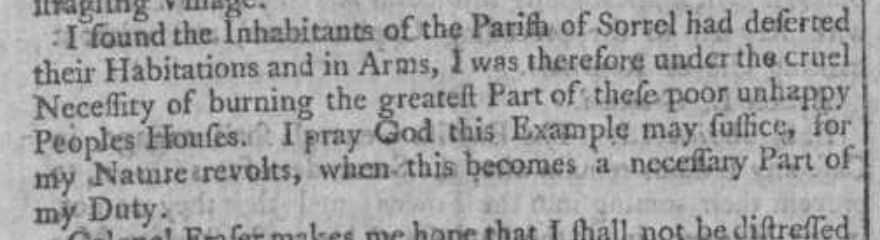
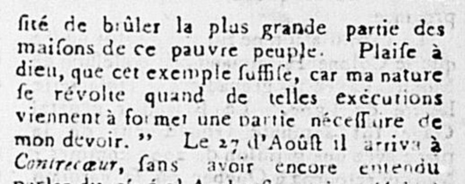
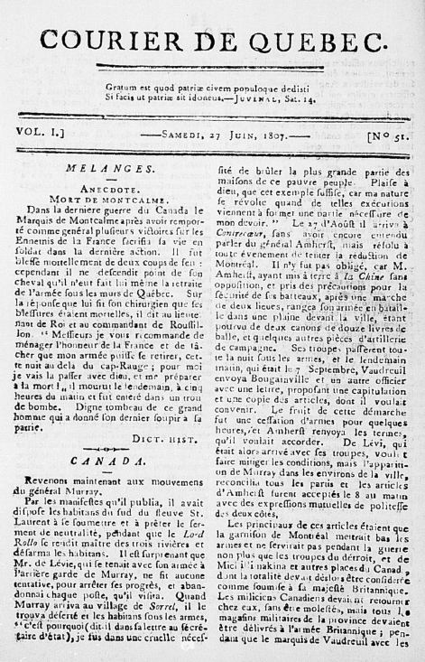

# Sorel, août 1760

Récit de l’arrivée de l’armée anglaise à Sorel en 1760 tel que relaté par le général James Murray :  

*« I found the Inhabitants of the Parish of Sorrel had deserted their Habitations in Arms, I was therefore under the cruel Necessity of burning the greatest Part of the poor unhappy Peoples Homes. I pray God this Example may suffice, for My Nature revolts, when this becomes a necessary Part of my Duty. »*  
  
Extract of a Letter from the Honourable Brigadier General Murray to the Right Honourable Mr. Secretary Pitt, dated Contrecoeur, nine Leagues from Montreal, August 24, 1760, London Gazette Extraordinary , 6 octobre 1760  

On retrouve également ces propos traduits en français en 1807 dans Le courier de Québec :  

*Quand Murray arriva au village de Sorrel, il le trouva déserté et les habitants sous les armes, « c’est pourquoi (dit-il dans sa lettre au secrétaire d’État) je fus dans une cruelle nécessité de brûler la plus grande partie des maisons de ce pauvre peuple. »*  

*« Plaise à Dieux que cet exemple suffise, car ma nature se révolte quand de telles exécutions viennent à former une partie nécessaire de mon devoir. »*  

  
  
Le Courier de Québec, 27 juin 1807  

On se doit de remarquer que l’armée britannique avait bien sûr adopté la destruction de village comme tactique militaire ailleurs dans la colonie. Par exemple, à l’issue du siège de la ville de Québec l’année précédente, en 1759 :  

*« Après avoir presque entièrement détruit la ville, Wolfe se jeta sur les campagnes. Tout fut ravagé, à droite du Saint-Laurent, depuis Sainte-Croix à la Rivière-du-Loup, en bas, et, à gauche, depuis Montmorency à La Malbaie. 1 400 maisons furent incendiées. »* (J. A. Marrault, 1866, p 483)  

La notice de la BAnQ pour Le Courier de Québec, qui était publié aux deux semaines en 1807 et 1808, relate que cette publication «cherche un compromis entre les classes professionnelles de langue française et la bourgeoisie de langue anglaise. Il exprime les opinions de l’élite et fait l’éloge des institutions britanniques.»  
  

Publié le 26 avril 2021  

Par cpeloquin  
Catégorisé comme Histoire, Notes de lecture, Sorel-Tracy  
Étiqueté abénaquis, histoire, nouvelle-france, sorel  
